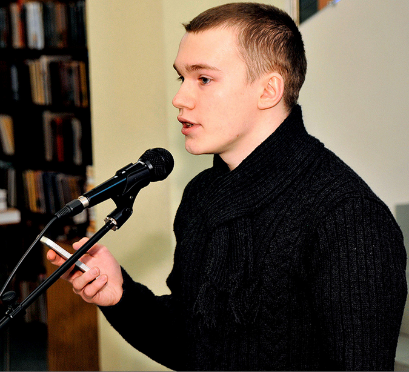
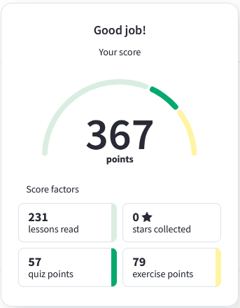

## **[RS School-cv](https://rs.school/js/)** 
  
#  **Alexandr Kravchuk (27 years old)**
## **Junior Frontend Developer**
Contact information:  

   * Phone: 8 (921) 963-95-35;
   * E-mail: sascha977@yandex.ru;
   * GitHub: <https://github.com/Kreastor>;
   * Discord: Alexandr Kravchuk(@Kreastor).

## **About Me:**

  I have a higher education in the field of maintenance of service equipment in tourist complexes.
  For the last 4 years I have worked in the supply department at large factories in Russia.
  I am currently studying web development and want to become a web developer. The experience in the equipment department made me understand my strengths, which are well suited for a programmer.

  First, it is perseverance. Drawing up multi-line contracts (from 100 to 400 pages) for various foreign counterparties and their coordination with the legal department.

  Secondly, Excel coding. Editing and writing functionality in excel files for tenders. (vendor comparison forms, etc.)

  Thirdly, Soft skills. Ability to work in a team to achieve a common goal. Ability to listen and constructively convey ideas and thoughts. I also have a positive mentoring experience.

  Fourth, the ability to learn quickly. I started working as a purchasing engineer with no work experience. Six months later, I was promoted to the position of Lead Purchasing Specialist. After 2 years, I was promoted to the head of the department.

  And finally, immersion in the problems and tasks of business. When doing my job in the company, I always interpret myself as part of this company. Plunging into business problems, it is easier to understand how to help the business and in what direction to develop in order to bring more income to the business

  I believe, that my ability to learn and to gain new skills will lead me through this path of becoming a proficient Frontend Developer.

## **Skills:**

  * HTML
  * CSS (Framework Bootstrap, Preprocessor (SCSS,SASS,KIT), BEM methodology)
  * JavaScript (Basics)
  * Git, GitHub
  * Adobe Photoshop, Figma
  * VSCode

 ## **Code example:**

**Get the Middle Character**
  You are going to be given a word. Your job is to return the middle character of the word. If the word's length is odd, return the middle character. If the word's length is even, return the middle 2 characters.

```
    function getMiddle(s) {
    return s.substr(Math.ceil(s.length/2 -1), s.length % 2 === 0 ? 2 : 1);
    }  
```
## **Educational projects:**

  * <https://github.com/Kreastor/1-Band-Template.git> - My training layout using bootstrap 5 and some java script (without adaptive). Layout taken from <https://www.w3schools.com/>
  * <https://github.com/Kreastor/Blog-Template.git> - Layout using grids. No adaptive. Layout taken from <https://www.w3schools.com/>

## **Courses:**
HTML and CSS Tutorials on the [w3schools](https://www.w3schools.com/)   
  
## **Languages:**

  * Russian - Native
  * English - Pre-Intermediate
    